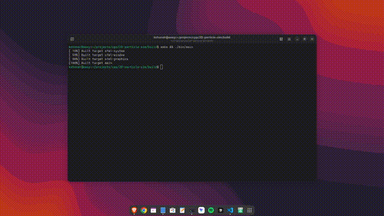
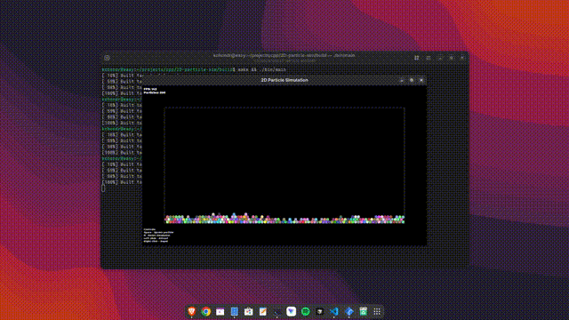
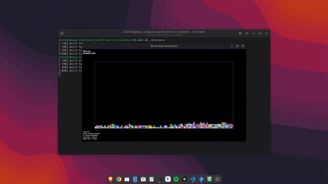
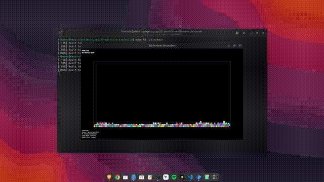

# 2D Particle Simulation

A real-time particle physics simulation built with C++ and SFML. Features particle collisions, boundary physics, and interactive mouse forces.

## Demo


*Particles with gravity and collisions*


*Attract and repel particles with mouse*


*Press Space to spawn new particles*


*Press R to reset*

## Features

- Particle-to-particle collisions with mass-based momentum transfer
- Boundary collisions (floor, walls, ceiling)
- Interactive mouse forces (attract/repel)
- Real-time particle spawning

## Controls

| Key/Input | Action |
|-----------|--------|
| Space | Spawn particle |
| R | Reset simulation |
| Escape | Quit |
| Left click | Attract particles toward cursor |
| Right click | Repel particles away from cursor |

## Build & Run

Prerequisites: CMake 3.28+ and a C++17 compiler. SFML 3.0 is fetched automatically via CMake.

```bash
cmake -S . -B build
cmake --build build
cd build && ./bin/main
```

## How It Works

- **Integration:** Semi-implicit Euler method for numerical stability
- **Collision Detection:** N-body pairwise collision checking.
- **Collision Response:** Velocity decomposition into normal/tangential components with restitution

## Further Optimizations

There are two main areas that could be optimized. The naive approach was chosen for its simplicity, as my goal was to familiarize myself with the particle collision problem, not create a performant real-world simulation.

**Collision Detection:** Currently uses O(n²) pairwise comparisons. As particle count increases, frame rates drop significantly. This could be improved with spatial partitioning (e.g., a grid or quadtree) to reduce comparisons to near O(n).

**Rendering:** Each particle uses `sf::CircleShape`, requiring a separate `draw()` call per particle. This is expensive. A more efficient approach would be to draw particles using triangles. This would allow us to use a `sf::VertexArray` of triangles, where all particles are stored in one array and drawn with a single `draw()` call.

## Tech Stack

- C++17
- SFML 3.0
- CMake

